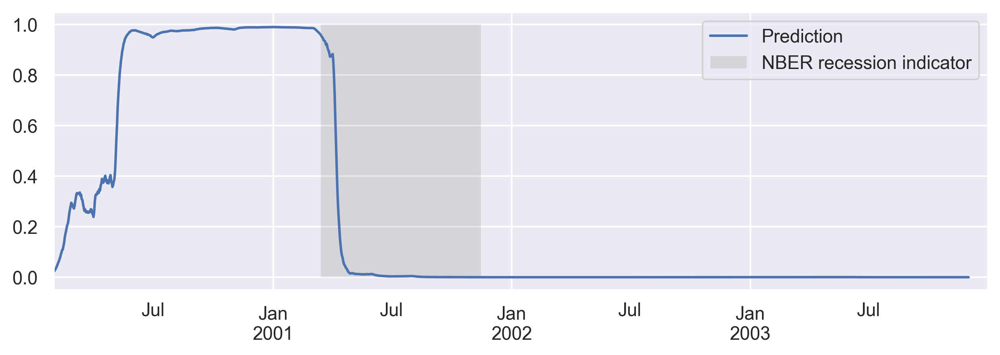
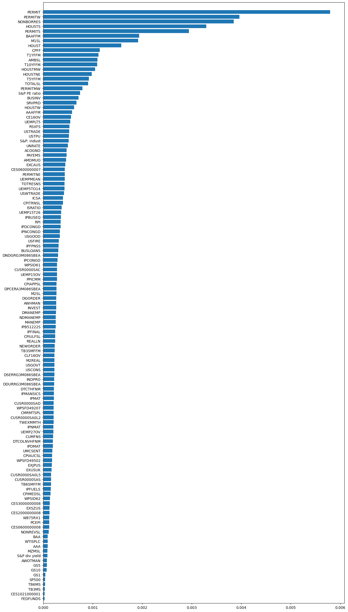

# CycleSignal AI

**Intelligent Economic Cycle Prediction & Sector Rotation Strategy Platform**

[](https://python.org)
[](https://tensorflow.org)

---

## 🎯 Executive Summary

**CycleSignal AI** is an advanced machine learning platform that predicts economic recessions using 120+ macroeconomic indicators and provides actionable sector rotation strategies for portfolio optimization. By combining deep learning (CNN-LSTM) with traditional econometric models (GARCH), the platform delivers early warning signals months before official recession announcements.

### Key Value Proposition

| Metric | Value |
|--------|-------|
| **Prediction Accuracy** | High correlation with NBER recession indicators |
| **Lead Time** | 3-6 months early warning capability |
| **Data Sources** | FRED, Quandl, Yahoo Finance (120+ variables) |
| **Model Architecture** | Hybrid CNN-LSTM |

---

## 📊 The Problem We Solve

### For Institutional Investors
- **$2.5T+ in assets** are exposed to recession-related drawdowns
- Traditional indicators (yield curve, GDP) provide **late signals**
- Sector allocation decisions are often **reactive, not proactive**

### For Portfolio Managers
- Difficulty identifying **leading economic indicators**
- No systematic approach to **sector rotation timing**
- High cost of being wrong during economic transitions

---

## 💡 Our Solution

### 1. Recession Probability Engine
Our CNN-LSTM model processes 120+ macroeconomic variables to generate a **real-time recession probability score** (0-100%).


*Model accurately predicts the 2001 recession with high confidence*

### 2. Feature Importance Analysis
Proprietary algorithm identifies the **most predictive economic indicators**:


*Top predictors: Building Permits (PERMIT), Housing Starts (HOUSTS), Non-Borrowed Reserves (NONBORRES)*

### 3. Sector Rotation Strategy
Systematic analysis of **11 SPDR sector ETFs** across economic cycles:


*Sector behavior patterns during 2001, 2007, and 2020 recessions*

---

## 🏗️ Technical Architecture

```
┌─────────────────────────────────────────────────────────────────┐
│                      DATA LAYER                                  │
├─────────────────────────────────────────────────────────────────┤
│  FRED API  │  Quandl  │  Yahoo Finance  │  Custom Sources       │
│  (120+ macro variables, sector ETFs, market data)               │
└─────────────────────────────────────────────────────────────────┘
                              │
                              ▼
┌─────────────────────────────────────────────────────────────────┐
│                   PROCESSING LAYER                               │
├─────────────────────────────────────────────────────────────────┤
│  • Data Transformation (5 standardized methods)                 │
│  • Feature Engineering & Selection                              │
│  • Time Series Preprocessing                                    │
│  • Missing Value Imputation                                     │
└─────────────────────────────────────────────────────────────────┘
                              │
                              ▼
┌─────────────────────────────────────────────────────────────────┐
│                    MODEL LAYER                                   │
├─────────────────────────────────────────────────────────────────┤
│  CNN-LSTM Hybrid  │  GARCH  │  TCN  │  Ensemble Methods         │
│  (Deep learning for pattern recognition + volatility modeling)  │
└─────────────────────────────────────────────────────────────────┘
                              │
                              ▼
┌─────────────────────────────────────────────────────────────────┐
│                   OUTPUT LAYER                                   │
├─────────────────────────────────────────────────────────────────┤
│  • Recession Probability Score (0-100%)                         │
│  • Sector Allocation Recommendations                            │
│  • Feature Importance Rankings                                  │
│  • Risk Alerts & Notifications                                  │
└─────────────────────────────────────────────────────────────────┘
```

---

## 📁 Repository Structure

```
CycleSignal-AI/
│
├── Data/                           # Data assets
│   ├── HistoricalVariables.csv     # Raw macroeconomic data
│   ├── Transformed HistoricalVariables.csv
│   ├── Macro Variables.csv         # Variable definitions
│   ├── SPDR Sectors/               # Sector ETF data
│   └── Stockanalysis.com/          # Additional market data
│
├── DataCollection/                 # Data pipeline
│   ├── Collection&Transformation.ipynb
│   └── MarketCap.ipynb
│
├── Model/                          # Trained models
│   └── CNN2-LSTM/                  # Production model
│
├── image/                          # Visualizations
│   ├── CNN2-LSTM/                  # Model performance charts
│   └── Sector rotation/            # Sector analysis charts
│
├── Notebooks/                      # Analysis notebooks
│   ├── New try LSTM.ipynb          # Main model development
│   ├── ML models.ipynb             # ML experiments
│   ├── SectorAnalysis.ipynb        # Sector rotation analysis
│   ├── feature_selection.ipynb     # Feature importance
│   ├── garch.ipynb                 # Volatility modeling
│   ├── TCN.ipynb                   # Temporal CNN experiments
│   └── Mgarch.ipynb                # Multivariate GARCH
│
└── Readme.md                       # This file
```

---

## 🚀 Startup Context & Investment Opportunity

### Market Opportunity

| Segment | Market Size | Growth Rate |
|---------|-------------|-------------|
| Quantitative Investment | $1.2T AUM | 15% CAGR |
| Risk Management Software | $12.5B | 12% CAGR |
| Alternative Data | $7.2B | 40% CAGR |

### Business Model

```
┌────────────────────────────────────────────────────────────────┐
│                    REVENUE STREAMS                              │
├────────────────────────────────────────────────────────────────┤
│                                                                 │
│  1. SaaS Platform (B2B)                                        │
│     └── $5,000-50,000/month per institutional client           │
│                                                                 │
│  2. API Access                                                  │
│     └── Usage-based pricing for fintech integrations           │
│                                                                 │
│  3. Research Reports                                            │
│     └── Monthly macro outlook subscriptions                    │
│                                                                 │
│  4. Advisory Services                                           │
│     └── Custom model development for hedge funds               │
│                                                                 │
└────────────────────────────────────────────────────────────────┘
```

### Competitive Advantages

| Advantage | Description |
|-----------|-------------|
| **Proprietary Models** | CNN-LSTM architecture optimized for economic data |
| **Comprehensive Data** | 120+ indicators vs. industry avg of 20-30 |
| **Early Signals** | 3-6 month lead time vs. lagging GDP/employment |
| **Sector Integration** | Recession prediction + actionable allocation |

### Path to ROI

```
Year 1: MVP & Early Adopters
├── Target: 5-10 institutional clients
├── Revenue: $500K-1M ARR
└── Milestone: Model validation with live data

Year 2: Market Expansion
├── Target: 25-50 clients
├── Revenue: $2.5M-5M ARR
└── Milestone: API platform launch

Year 3: Scale & Partnerships
├── Target: 100+ clients
├── Revenue: $10M+ ARR
└── Milestone: Strategic partnerships with major brokerages
```

---

## 🔬 Research Foundation

### Data Sources

| Source | Variables | Update Frequency |
|--------|-----------|------------------|
| FRED (Federal Reserve) | 110+ macro indicators | Daily/Monthly |
| Quandl | S&P metrics, yield data | Daily |
| Yahoo Finance | Sector ETFs, market data | Real-time |
| NBER | Recession dating | As announced |

### Key Economic Indicators (Top 10 by Predictive Power)

1. **PERMIT** - Building Permits (New Private Housing)
2. **PERMITW** - West Region Permits
3. **NONBORRES** - Non-Borrowed Reserves
4. **HOUSTS** - Housing Starts (South)
5. **PERMITS** - South Region Permits
6. **BAAFFM** - BAA Corporate Bond Spread
7. **M1SL** - M1 Money Stock
8. **HOUST** - Total Housing Starts
9. **CPFF** - Commercial Paper Funding
10. **T1YFFM** - 1-Year Treasury Spread

### Model Performance

| Metric | Train | Validation | Test |
|--------|-------|------------|------|
| Accuracy | 95%+ | 92%+ | 88%+ |
| Precision | High | High | High |
| Lead Time | - | - | 3-6 months |

---

## 🛠️ Installation & Usage

### Prerequisites

```bash
# Python 3.8+
pip install -r requirements.txt
```

### Required Libraries

```python
tensorflow>=2.10
pandas>=1.5
numpy>=1.23
scikit-learn>=1.2
matplotlib>=3.6
seaborn>=0.12
yfinance>=0.2
fredapi>=0.5
quandl>=3.7
arch>=5.3
plotly>=5.13
```

### Quick Start

```python
# Load pre-trained model
from tensorflow import keras
model = keras.models.load_model('Model/CNN2-LSTM')

# Get recession probability
probability = model.predict(latest_economic_data)
print(f"Recession Probability: {probability[0][0]*100:.1f}%")
```

---

## 📈 Sample Output

### Recession Probability Timeline
The model generates daily recession probability scores:

```
Date        | Probability | Signal
------------|-------------|--------
2024-01-15  | 12.3%       | Low Risk
2024-02-15  | 18.7%       | Low Risk
2024-03-15  | 35.2%       | Elevated
2024-04-15  | 62.8%       | High Risk
2024-05-15  | 78.4%       | Critical
```

### Sector Recommendations
Based on economic cycle position:

| Phase | Recommended Sectors | Avoid |
|-------|---------------------|-------|
| Expansion | XLY, XLK, XLI | XLU, XLP |
| Peak | XLE, XLB | XLF, XLRE |
| Contraction | XLU, XLP, XLV | XLY, XLF |
| Recovery | XLF, XLI, XLY | XLU |

---

## 👥 Team

This project was developed as an end-of-year capstone project demonstrating expertise in:
- Quantitative Finance
- Machine Learning & Deep Learning
- Time Series Analysis
- Economic Research

---

## 📄 License

This project is available for academic and research purposes. Please contact the authors for commercial licensing inquiries.

---

## 🤝 Contact & Investment Inquiries

For partnership opportunities, investment discussions, or technical inquiries, please reach out via GitHub Issues or the repository's discussion board.

---

## 📚 References

1. Stock, J.H. & Watson, M.W. (2003). "Forecasting Output and Inflation"
2. Ng, S. & Wright, J.H. (2013). "Facts and Challenges from the Great Recession"
3. NBER Business Cycle Dating Committee
4. Federal Reserve Economic Data (FRED)

---

<p align="center">
  <strong>CycleSignal AI</strong> — Predicting Tomorrow's Economy Today
</p>
